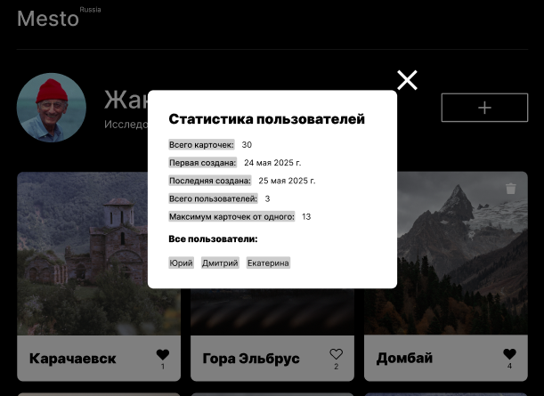

# Mesto

Интерактивная страница для обмена фотографиями мест. Пользователи могут редактировать профиль, добавлять и удалять карточки, ставить лайки и просматривать статистику группы.

## Ссылка на проект

[https://nikitosii.github.io/mesto-production/](https://nikitosii.github.io/mesto-production/)

## Результат

## Технологии

- HTML, CSS (BEM)
- JavaScript (ES6-модули)
- Vite
- REST API (mesto.nomoreparties.co)

## Функциональность

- Загрузка данных пользователя и карточек с сервера при открытии страницы
- Редактирование профиля: имя, описание, аватар
- Добавление новых карточек с публикацией на сервере
- Удаление собственных карточек с подтверждением
- Лайки с синхронизацией и счётчиком
- Просмотр фото в полноэкранном режиме
- Статистика пользователей по клику на логотип
- Валидация форм с кастомными сообщениями об ошибках
- Индикатор загрузки на кнопках во время запросов к серверу